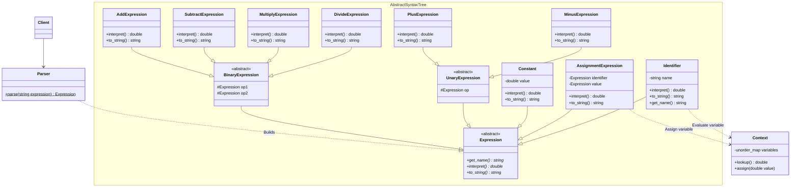

# Interpreter

This is a small C++ terminal application meant to implement a small language interpreter for arithmetic expressions.

### Build

> [!IMPORTANT]
> [gtest](https://github.com/google/googletest) is required to test the project.
> The package on Debian is `libgtest-dev`.

```sh
# from the project root directory
cmake -B build # configure cmake
cmake --build build # build all targets
```

### Run

```sh
build/interpreter
```

The executable will launch a [REPL](https://en.wikipedia.org/wiki/Read%E2%80%93eval%E2%80%93print_loop) wherein you can type arithmetic expressions.

Usage tips:
- type `exit` to quit
- type `clear` to flush the terminal
- variable assignment: `var = 1`
- variable usage: `var + 2` (produces `3`)
- supported operations are `+`, `-`, `*`, `/`, `^` (power)
- number literals can be either integers or floating points

[grammar.bnf](./grammar.bnf) contains a [Backus-Naur Form](https://en.wikipedia.org/wiki/Backus%E2%80%93Naur_form) [grammar](https://en.wikipedia.org/wiki/Context-free_grammar) of the interpreted language.

### Test

```sh
# after build
ctest --extra-verbose --test-dir build
```


## Class diagram



### See also

- [qalculate](https://github.com/Qalculate/libqalculate)
